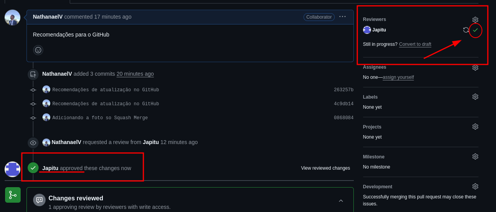
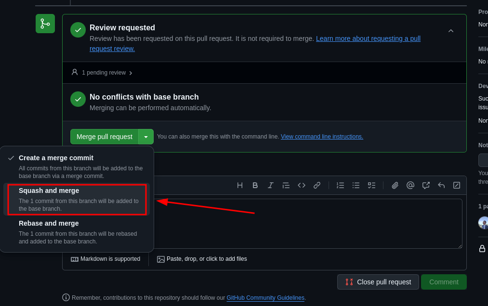
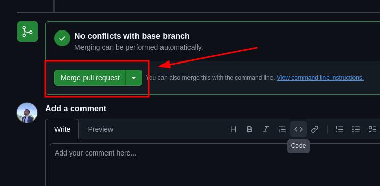
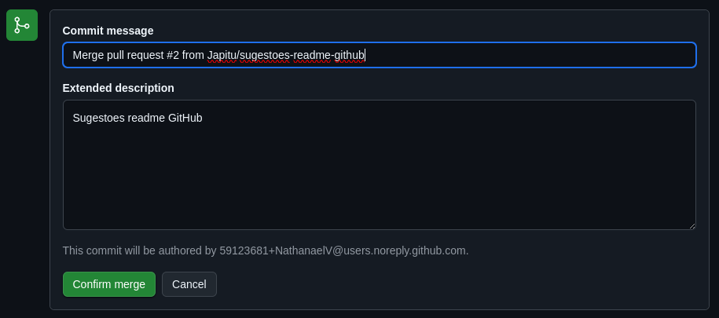
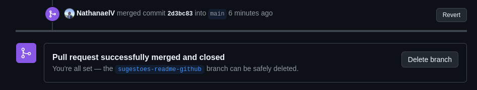

# Eco Alerta Tecnologia

# Projeto Challenge

**Objetivo do Projeto:** <br>
Somos uma plataforma digital voltada para o monitoramento em tempo real e a <br>
resposta rápida a desastres naturais em São Paulo e região do Grande ABCD. Nossa <br> 
solução integra informações críticas sobre eventos climáticos extremos, alagamentos e <br> 
outras catástrofes, permitindo à população e autoridades acesso rápido e centralizado <br>
a dados confiáveis. 

## Estrutura de pastas e arquivos

vitalink/                       <br>
├── index.html $\quad$ &nbsp;           # Página principal do site                <br>
├── script.js  $\quad$ $\quad$ &nbsp;   # Arquivo JavaScript com interações       <br>
├── style.css  $\quad$ $\quad$          # Estilos da página                       <br>
├── .gitignore  $\quad$ $\quad$          # arquivos para git ignorar                       <br>
├── README.md  $\quad$ $\quad$          # Instruções                       <br>
├── img/ $\quad$ $\quad$ $\quad$ &nbsp; # Pasta com imagens usadas no projeto     <br>
│ $\quad$ ├── augusto.jpg                                   <br>
│ $\quad$ ├── donate.jpg                                   <br>
│ $\quad$ ├── mapa sao paulo.jpg                                   <br>
│ $\quad$ ├── nathan.PNG                                    <br>
│ $\quad$ ├── rodrigo.PNG                                   <br>
│ $\quad$ ├── vitimas sul.webp                              <br>
│ $\quad$ └── logos/                # Subpasta com logos    <br>
│ $\quad$ $\quad$ ├── Defesa-Civil-logo-portal.jpg      <br>
│ $\quad$ $\quad$ ├── google maps.jpg      <br>
│ $\quad$ $\quad$ ├── logo eco alerta.png    <br>
│ $\quad$ $\quad$ ├── prefeitura.png    <br>
│ $\quad$ $\quad$ └── zl mapa.png    <br>
├── readme-img/ $\quad$ $\quad$ $\quad$ &nbsp; # Pasta com imagens para README     <br>
│ $\quad$ ├── image-1.png                                   <br>
│ $\quad$ ├── image-2.png                                   <br>
│ $\quad$ ├── image-3.png                                   <br>
│ $\quad$ ├── image-4.png                                   <br>
│ $\quad$ ├── image-5.png                                   <br>
│ $\quad$ ├── image-6.png                                   <br>
│ $\quad$ ├── image.png                                   <br>


## Tecnologia Utilizada: 
- **HTML5** – Marcação da estrutura das páginas
- **CSS3** – Estilização do layout e responsividade
- **JavaScript (Vanilla JS)** – Lógica de interação da página
- **Editor de código:** VS Code (opcional, se quiser informar)
- **Imagens e assets estáticos** – PNG, JPG usados para identidade visual


## Integrantes do Grupo
Augusto Bonomo Junior - RM565155            <br>
Nathanael Cândido Mattos Vieira - RM564990  <br>
Rodrigo Carvalho Silva - RM565162           <br>

Endereço Repositório do Projeto no GITHUB: https://github.com/NathanaelV/FIAP-Challenge-Front-end 

---
---

## Recomendações de atualizações:

### No terminal

1. Fazer o clone na sua máquina

```bash
git clone git@github.com:Japitu/1TDSR.git
```

2. Entrar na pasta GS-\<NomeDaMateria\>-EcoAlerta

```bash
cd GS-<NomeDaMateria>-EcoAlerta
``` 

3. Caso já tenha a pasta na sua maquina, antes de começar a trabalhar, certifique-se de que está na `main`, faça um Pull do repositório:

```bash
git status
git pull
```

Assim irá atualizar o seu repositório local com o repositótio no GitHub

4. Criar uma branch para trabalhar na atualização. O nome da branch tem a ver com a tarefa que será feita

``` bash
git checkout -b <nome-da-sua-branch>
```

Exemplo:
```bash
git checkout -b cria-README
```

5. Faça as alterações necessárias. Após terminar, faça o commit 

```bash
git add .
git commit -m 'Nome da mensagem'
```

Exemplo:
```bash
git commit -m 'Cria o tutorial para criar e modificar uma branch no repositorio local'
```

6. Fazer o push para o repositório, porém pela branch que foi criada. Não volte para `main`.

```bash
git push origin <nome-da-sua-branch>
```

7. Após **finalizar** o passo 8 do processo do **GitHub**. Volte para a `main` e pode apagar a branch onde estava trabalhando.

```bash
git checkout main
git branch -D <nome-da-sua-branch>
```
<br>

---


### No GitHub

1. Acesse o repositório no GitHub. Após fazer o push verá a tela abaixo. Clique em **Compare & pull request**.


2. Prencha o título e adicione uma descrição, se achar necessário

3. Solicite a revisão de um dos responsáveis


4. Só clicar em **Create pull request**.

5. Aguarde a aprovação do PR (Pull Request):



6. Clique em **Squash and merge** para fazer o Merge.





7. Caso queira, pode alterar a mensagem do commit do merge ou adicionar um descrição. Após isso, só confirmar o merge.



8. Se tudo der certo, verá uma tela parecida com a que está abaixo. Significa que deu tudo certo. Pode clicar em **Deletar branch**.



